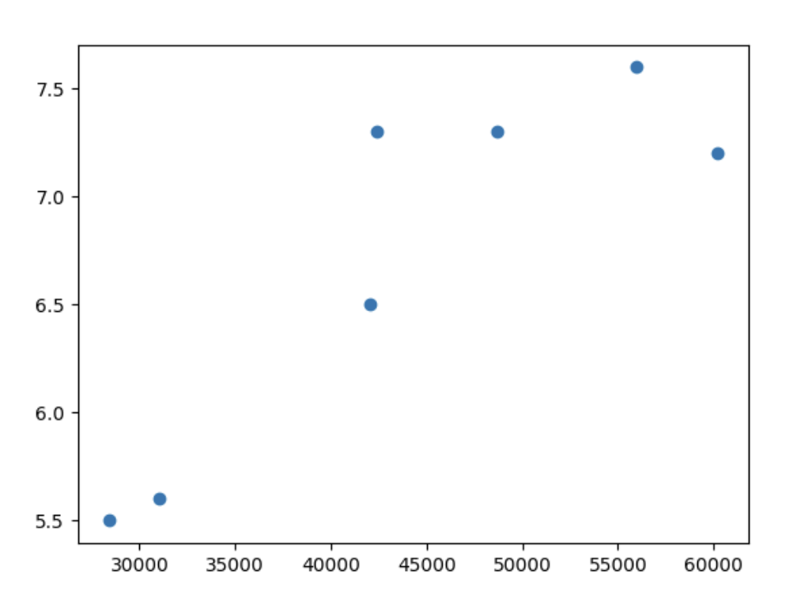
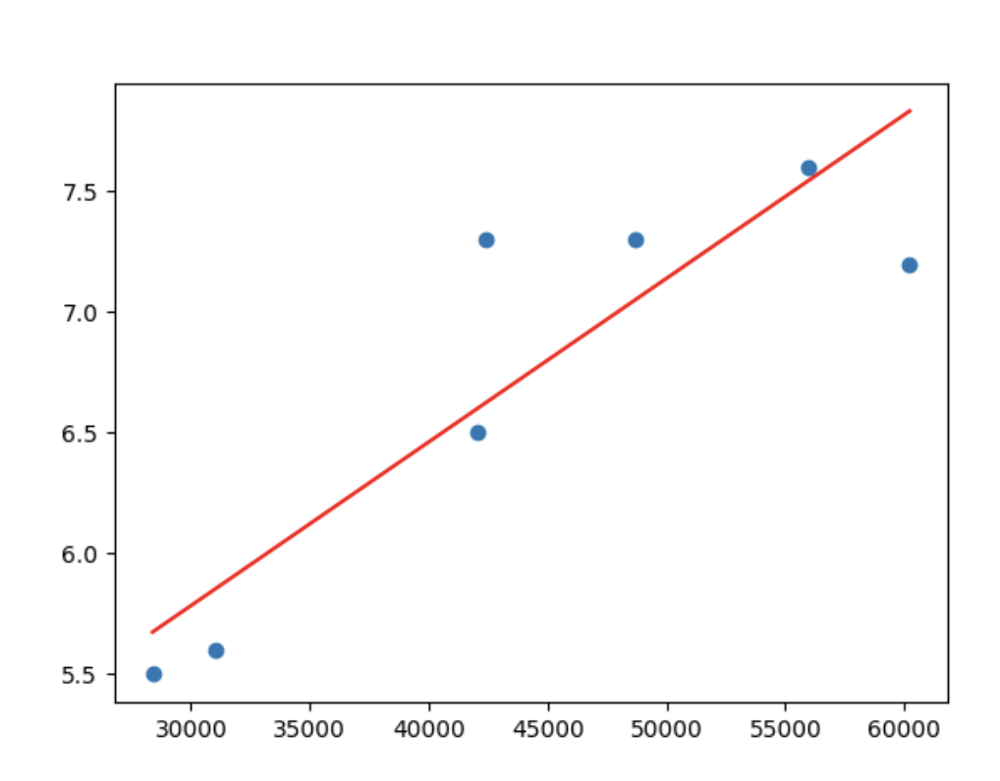

# What is machine Learning ?

1.Machine learning is the science (and art) of programing computers so they can learn from data
2. A computer program is said to learn from experience E with respect to some task T and some performance measure
P , if it's performance on T, improves with experience E

For instance a spam filter is a machine learning program that, given examples of spam emails flagged by users and examples
of regular emails (non spam, also called "ham"), can learn to flag spam. The examples that the system uses to learn are
called the training set. Each training example is called a training instance (or sample). The part of a machine learning
system that learns and makes predictions is called a model. Neural networks and random forests are examples of models.

In this case, the task T is to flag spam for new emails, the experience E is the training data , and the performance  p
needs to be define ; for example for t you can use the ratio of correctly classified emails. This particular performance measure
is called accuracy, and it is often used in classification tasks.

# Why use Machine Learning ?

Consider how would you write a spam filter using traditional programming techniques

1. first examine what spam typically looks like m might notice some words like 4u or credit card , free

2. write a detection algorithm that looks for these particular words .

3. lunch and test the program -> write new rules   if not sufficient enough (essentially the algorithm would become a
long list of rules )

the issue with that approach is first of all its not practical, to many rules second of all what if spammers notice all
their emails containing "4u" are blocked; then they might start using "For u" instead, now I would have to make this a
new rule. In contrast, a machine learning program will automatically notices that "For U" has becomes unusually frequent
in spam flagged by users

Another area where machine learning shines is for problem that are to complex to solve or no know algorithm to solve them
for example if you write a program that try to know if someone said the letter T, well you might use the fact that at a
certain point the pitch is higher but what if that person is not speaking out whispering then that one algorithm wouldn't
work anymore. Finally machine learning can help human learn. ML models can be inspected to see what they have learned (al
tough for some models this is tricky). For instance once a spam filter has been trained on enough spam, it can be inspec-
ed  to see what is a trending words that spam uses. Sometimes this inspection can lead to unsuspected correlations or new
trends. Digging into large amounts of data to discover hidden patterns is called data mining, and machine learning excels
at it .

## Type of Machine learning Systems

There are so many different types of machine learning systems that it is useful to classify them in broad categories based
on the following criteria:

How they are supervised during training (supervised, unsupervised, semi-supervised, self-supervised and others)

Whether or not they can learn incrementally on the fly(online versus batch learning)

Whether they work by simply comparing new data points to known data points, or instead by detecting patterns in the
training data and building a predictive model, much like scientists do (instance-based versus model-based learning)

These criteria are not exclusive; you can combine them in any way you like . For example, a state-of-art spam filter
may learn on the fly using deep neural network model trained using human-provided examples of spam and ham; this makes it
an online, model-based,supervised learning system.

## Training Supervision

ML systems can e classified according to the amount and type of supervision they get during training. There are so many
categories, but we'll discuss the main ones: supervised learning, un-supervised learning, self-supervised learning,
semi supervised learning and reinforcement learning.

What is Supervised learning?
In supervised learning, the training set you feed to the algorithm includes the desired solutions, called labels. (Note
The main dea is based on the labeled instances we classify new instances. A typical learning task is classification.)
The spam filter is a good example  of this: it is trained with many example emails along with their class (spam or ham),
ot must learn how to classify new emails. Another typical task is to predict target numeric value, such as the price of a
car, given a set of features(mileage, age, brand, etc.). Ths sort of task is called regression. To train the system, you
need to give it many examples of cars, including both their features and their target(i.e, their prices).Note that some
regression models can be used for classification as well, and vice versa. For example, logistic regression is commonly
used for classification, as t can output a value that corresponds to the probability of belonging to a given class e.g
20% chance of being spam).

## What is Unsupervised learning?

In unsupervised learning, as you might guess, the training data is unlabeled. The system tries to learn without a teacher.
For example, say you have a lot of data about blog's visitors. You may want to run clustering algorithm  to try to detect
groups of similar visitors. At not point do you tell the algorithm which group of visitor belongs to: it finds those
connections without your help. For exampl, it might notice  that 40% of your visitor are teenagers who love comic books
and generally rad your blog after school, while 20% are adults who enjoy sci-fi and who visit during the weekends. If you
use a hierarchical clustering algorithm,it may also subdivide each group into smaller groups. This may help you target your
posts for each group. Visualization algorithms are also good examples of unsupervised learning you feed them a lot of
complex and unlabeled data and they output a 2D or 3D representation of your data that can easily be plotted. These algo-
rithms try to preserve as much structure as they an (e.g trying to keep separate clusters in the input space from overlapping
in the visualization) so that you can understand how the data is organized and perhaps identify unsuspected patterns.
A related task is dimensionality reduction, in which the goal is to simplify the data without loosing to much information
. One way to do this is to merge several correlated features into one. For example, a car's mileage may be strongly correlated
with its age, so the dimensionality reduction algorithm will merge them onto one feature that represents the car's wear and tear
. This is called feature extraction. It is often good idea to try to reduce the number of dimensions in your training data
using a dimensionality reduction algorithm before you feed it to another machine learning algorithm (such as a supervised
learning algorithm.) It will run much faster, the data will take up less disk and memory space, and in some cases it may
also perform better.

Yet another important unsupervised task is anomaly detection -- for example, detecting unusual credit card transactions to
prevent fraud catching manufacturing defects or automatically removing outliers from a dataset before feeding it it to another
learning algorithm . The system is shown mostly normal instance, it can tell whether it looks like a normal one or whether
it is likely an anomaly . A very similar task is  novelty detection: it aims to detect new instances  that look different
from all instances in the training set. This requires having a very "clean" training set, devoid of any
instance that you would like the algorithm to detect. For example if you have thousands of pictures of dos and 1% of these
pictures represent chihuahuas, then a novelty detection algorithm should not treat new pictures of Chihuahuas as novelties.
On the other hand, anomaly detection algorithms may consider these dog as rare and so different from other dogs that
they would likely classify them as anomalies.  Finally another common unsupervised task is association rule learning
in which  the goal is to dig into large amounts of data and discover interesting relations between attributes. For
example, suppose you own a supermarket. Running an association rule on your sales logs may reveal that people who purchase
barbecue sauce  and potato chips also tend to buy steak. Thus, you may want to place these items close to one another.

## What is Semi-supervised learning?
Since labeling data is usually time-consuming and costly, you will often have plenty of unlabeled instances and few label
instances. Some algorithms can deal with data of unlabeled instances, and few label instances. Some algorithms can del with
data that's partially labeled.This is called semi-supervised learning. Such photo-hosting services, such as Google Photos
,are good examples of this once you upload all your fairly photos to the service, it automatically recognizes that the
same person A shows up in photos 1,5,11 while another person B shows up in photo 2,5 and 7. This is the unsupervised part
of the algorithm(clustering). Now all the system needs is for you to tell it who these people are. Just add one label
per person and it is able to name everyone in every photo, which is useful for searching photos. Most semi-supervised lea
-rnig  algorithms are combinations of unsupervised and supervised algorithms. For examples, a clustering algorithm may be
used to group similar instances together and then every unlabeled instance can be labeled with the most common label in its
cluster  . Once the whole data set is labeled, it is possible to use any supervised learning algorithm.


## What is  Self-supervised learning
Another approach to machine learning involves learning involves actually generating a fully labeled data set from a fully
unlabeled one. Again, once  the whole dataset is labeled any supervised learning algorithm can be used. This approach is called
self-supervised learning (e.g making a model recover an original image by masking some part of it ).The resulting model
may be quite useful in itself-- for example ,to repair damage images or to erase unwanted objects from pictures. But more
often than not, a model trained using self-supervised learning is not the final goal.You'll usually want to tweak and fine
-tune the model for a lightly different task--one that you actually care about. For example, suppose that what you really
want is to have a pet classification given a picture of any pet, it will tell you what species it belongs to.If you
have large data set of unlabeled photos of pets , you can start by draining an image-repairing  model using
self-supervised learning. Once it's performing well, it should be able to distinguish different pet species: when
 it repairs an image of a cat whose face is maked, it must know not to add a dog's face. (Assuming your model's architecture allows it.
 and most neural network architectures do), it is then possible to tweak the model sp that it predicts pet species instead of
 repairing images. The final step consist of fine tuning the model on a labeled dataset: the model already knows what cats
 ,dogs, and other pet species look like, so this step is only needed so the model can learn the mapping between species it already knows
 and the labels we expect from it .

 ## Reinforcement learning:
 Reinforcement learning is very different beast. The learning system, called an agent in this context, can observe the environment
 , select and perform action get rewards in return (or penalties in the form of negative rewards) I t must lean by itself
 what is the best strategy, called a policy, to get the most reward over time. A policy defines what actions the agent
 should choose when it is in a given situation.  For example, many robots implement reinforcement learning algorithms to
 learn how to walk. DeepMind's AlphaGo program is also a good example of reinforcement learning:
 some machine learning beat a chess champion...

 Batch Versus Online Learning:
 Another criterion used to classify machine learning systems is whether or not the system can learn incrementally from a
 stream of incoming data.

 ## Batch learning:
 In bach learning, the system is incapable of learning incrementally: it must be trained using all available data. This
 will generally take a lot of time and computing resources, so it is typically done offline. First the system is trained,
 and ten it is launched into production and runs without learning anymore; it just applies what it has learned. This is
 called offline learning. Unfortunately, a model's performance tends to decay over time, simply because the world continues
 to evolve while the model remains unchanged. This phenomenon is often called model rot or data drift. The solution is
 tp regularly retrain the model on up-to-data. How often you need to do that depends on the use case: if the model classifies
 pictures of dogs  and cats, its performance will decay slowly, but if the model deals with fast -evolving systems, for
 example making predictions on financial market , then it is likely to decay quite fast.  If you want a batch learning
 system to know about new data(such as new type of spam), you need to train a new version of the system from scratch on
 the full data set  (not just the new data,but also the old data), then replace the old model with the new one. Fortunately,
 the whole process of training , evaluating, and launching a machine learning system can be automated fairly easily. So
 even batch learning can adapt to change. Simply update the data and train a new version of the system from scratch as often as
 needed. This solution is simple and often works fine, but training using the full set of data can take many hours, so you
 would typically train a new system only every 24 hours or even just weekly. If your system needs to adapt to rapidly changing data
 then you need a more reactive solution. Also, training on the full set of data requires a lot of computing resources
 (CPU memory space, disk space, disk I/O, network I/0, etc.)    If you have a lot of data and you automate your system
 to train from scratch everyday, it will end u costing you a lot of money. If the amount of data is huge, it may even be
 impossible to use a batch learning algorithm.


 Finally, if your system needs to be able to learn autonomously and it has limited resources (e.g a smartphone application
 or a rover on mars),then carrying around large amounts of training data and taking up a lot of resources to train for hours
 everyday is a showstopper. A better option in all these cases is to use algorithms that are capable of learning incrementally

 Online learning:
 In online learning, you train the system incrementally by feeding it data instances sequentially, either individually or
 small groups called mini-batches. Each learning step is fast and cheap, so the system can learn about new data on the fly,
 as it arrives. Online learning is useful for systems that need to adapt to change extremely rapidly (e.g, to detect new
 patterns in the stock market) It is  also a good option if you have limited computing resources; for example, if the model
 is trained on mobile devices.Additionally, online learning algorithms can be used to train models on huge data sets that
 cannot fit in one machine's learning main memory . The algorithms loads part of the data, runs training step on that data,
 and repeats the process until it has run all of the data.

 One important parameter of online learning systems is how fast they should adapt to changing data: this is called the learning
 rate. If you set a high learning rate, then your system will rapidly adapt to new data,but it will also tend to quickly forget
 the old data(and you don't want a spam filter to flag only the latest kinds of spam it was shown). Conversely, if you set
 a low learning rate, the system will have more inertia, that is, it will learn more slowly,but it will also be less sensitive
 to noise in the new data or to sequences of non representative data points (outliers).

 A big challenge with online learning is that if bad data is fed to the system, the system's performance will decline,
 possibly quickly(depending on the data quality and learning rate). If it's a live system your clients will notice. For
 example, bad data could come from a bug (e.g a malfunctioning sensor on a robot), or it could come from someone trying
 to game the system(e.g spamming a search engine to try to rank high in search results). To reduce this risk, you need to
 monitor your system closely and promptly switch learning off(and possibly revert to previously working state)  if you
 detect a drop in performance. You may also want to monitor the input data and react to abnormal data; for example, using
 and anomaly detection algorithm.

 Instance-Based Vs Model-Based Learning
 One more way to categorize machine learning systems is by how they generalize. Most machine larning tasks are about making
 predictions. This means that given a number of training examples, the system  needs to be able to make good predictions
 fpr (generalize to) examples it has never seen before. Having a good performance measure on the training data is good, but
 insufficient; the true goal is to perform well on new instances. There are two main approaches to generalization:
 instance-based learning and model-based learning.

 ## Instance-based learning
 Possibly the most trivial form of learning is simply learn by heart. If you were to create a spa filter this way, it
 would just flag all emails that are identical to emails that have already been flagged by users-- not the worst solution,
 but certainly not the best. Instead of just flagging emails that are identical to known spam emails, your spam filter
 could be programmed to also flag emails that are very similar to known spam emails. This requires measure of similarity
 between two emails. A very basic  similarity measure between two emails could the count of the number of words they
 have in common. The system would flag an email as spam if it has many words in common with known spam email.
 This is called instance-learning : the system learns the examples by heart, then it generalizes to new cases by using a
 similarity measure to compare them to the learned examples(or subset of them).

## Model-based learning
 Model-based learning and a typical machine learning workflow
 Another way to generalize from a set of examples is to build a model of  these examples and then use that model to make
 predictions. This is called model-based learning. For example 
For exaple, suppose you  want to know if money makes people happy, so yoy download the Better Life data from the OECD's 
website (https://www.oecdbetterlifeindex.org)  and World.


Table 1-1. Does money make people happy
| Country | GDP per capita (USD) | Life Satisfaction |
|---------|---------------------|-------------------|
| Turkey | 28,384 | 5.5 |
| Korea | 27,195 | 5.6 |
| France | 37,675 | 6.5 |
| United States | 55,805 | 7.2 |
|New Zealand|42,404| 7.3
| Australia | 50,962 | 7.3 |
|Denmark| 55,938| 7.6 
 
 ```python
#1.Import the Libraries 
# pandas let u work with  tables of data , excel in python
import pandas as pd 
#take numbers and draw them
import matplotlib.pyplot as plt

#2. Create the table (DataFrame) with a dict
# meaning that when the key is the nae of the column and the data the vals is actually an array of values 
data = { 
    "Country": ["Turkey", "Korea", "France", "United States", "New Zealand", "Australia", "Denmark"],
    "GDP per capita": [28384, 31008, 42026, 60236, 42404, 48698, 55938],
    "Life Satisfaction": [5.5, 5.6, 6.5, 7.2, 7.3, 7.3, 7.6]
}
# store the data 
df = pd.DataFrame(data)

#3. Plot the data  (x,y) the names of the axes
# telling it what to draw x , and y based on the data table 
plt.scatter(df["GDP per capita"],df["Life Satisfaction"])

plt.show()

 ```
 ## Plot
 

Of course with more countries there will be some kind of trend . It will looks likes life satisfaction goes up more or less linearly as the country's GDP per capita incriseas (It is a bit noisy). So I decide to model life satisfaction as linear function of GDP per capita. This step is called model selection: You select the a linear model of life satisfaction with just one attribute, GDP per capita.


## Simple linear model
Now  that you have selected a linear model  
life_satisfaction = mx + b 
where m is  the slope x is the gdp per capita which is the input and b is some starting point we can change the values of m and b to find a line that suits best the data ploting. The issue is how do you figure out which equations is the best fit for the linaer model ? In other words, how does the machine knows what value for  and b are the best? To solve this issue you must give the machine a performance measure to grade itself and adjust. There are two ways of doing this 

1. A utility(fitness) function: this measures how good the model is.The machine goal's is to maximize this score.
2. Cost function: this measures how bad the model is. The machine goal's to minimize this score

## My definition
### Who is who?
1. The model: when we say the model we refering to the blueprint (it's like the class), and what we are saying is can this model define the relationship we looking for. For instance if we say, the relationship between hapiness and gdp per capita  can be defined as linear model,e .

2. The function: on the hand the function is the tool it's literally the function of this blue print that allows us to defien the relation ship of that model using a mathematical funciton. In our example, it helps us calculate a prediction.

3. The machine(The worker): When we talk about the machine's goal , we are talking about the learning algorithm ,`e.g Linear regression algorithm` . The machine  is the computer program the computer program that takes your training data and grades to find the best possible  numbers for that function. In other wordds the machine is not the hardware but the software system as whole inclding the learnign algorithm the model, the funciton

## Break
## Continuation
So just like we said before ew need to define the parameter values, the parameters are m and b whereas the attribute is x ,  and we said to know the best values for the parameters we use a performance measure either cost(how bad) or utility(how good) .For linear  regression problems, people typically use a cost function that measures the distance between the linear model's predictions and the training examples; the objective is tominimize the distance between these two .

This is where the linear regression algorithm comes in: you feed it  your training examples, and it finds the parameters that make the linaer model fit best to your data. This s called training the model. In our case =, the algorithms finds the optimal parameter values are b = 3.75 and m = 6.78 * 10^-5

```python 
#1. Import te library
import pandas as pd 
import mathplotlib.pyplot as plt
#math tools on arrays
import numpy as np

#2. define the data in a dict 
data = { 
    "Country": ["Turkey", "Korea", "France", "United States", "New Zealand", "Australia", "Denmark"],
    "GDP per capita": [28384, 31008, 42026, 60236, 42404, 48698, 55938],
    "Life Satisfaction": [5.5, 5.6, 6.5, 7.2, 7.3, 7.3, 7.6]
}

#3.store the data 
df = pd.DataFrame(data)
## tells what to draw
plt.Scatter(df["GDP per capita"], df["Life Satisfaction"])
#4. x value range
x = np.linspace(min(df["GDP per capita"]),  max(f["GDP per capita"]), 100) # generate a line betwee nthose values and a 100 of them

#5. Define your line
y = 6.78e-5 * x + 3.75 

#6.draw the line

plt.plot(x,y, color="red")

```


Finally ready to run the model to make predictions.

```python
import matplotlib.pyplot as plt
import numpy as np
import pandas as pd
from skleaern.linear_model import LinearRegression

#Download and prepare the data 
# just liek the name suggest its the main path where every other path dervied from meanign every subpath 
data_root = "https://github.com/ageron/data/raw/main"
# one such subpath is life/lifesat.csv  which is inside the main folder there is a folder called lifesat which has a csv file lifesat.csv
lifesat = pd.read_csv(data_root + "lifesat/lifesat.csv")

#Big X represents a matrix contains all features values
X =  lifesat[["GDP per capita (USD)"]].values

#Little y represents  a vector , these are the labels in our case  life satisfaction scores the right answers 
y = lifesat[["Life satisfaction"]].values
#Visualize the data
lifesat.plot(kind='scatter', grid=True, x ="GDP per capita (USD)", y= "Life satisfaction")
plt.axis([23_500,62_500,4, 9])
plt.show()

#Select a linear model
model = LinearRegression()
#Train the model 
model.fit(X,y)
#Make a prediction for cyprus
X_new = [[37_655.2]]

print(model.predict(X_new))
```


## Instanced Based Learning 
I f you had used an instanced based learning algorithm instead, you would have found that Israel has the closest gdp per capita to that of Cyprus($38,341) and since the OECD data tells us that Israelis life satisfaction is 7.2 for Cyprus. If you zoom out a bit and look at the two next closest countrie, you will find Lithuania and Slovenia, both with a life satisfaction of 5.9. Averaging these three values, you get 6.33, which is pretty close to the model-based prediction. This simple algorithm is called k-naerrest neighbors regression (in this example, k =3) 
Replacing the linear regression model with k-nearest neighbors regression in the previous code is as easy as replacing these 3 lines

```python
from sklearn.linear_model import KNeighborsRegressor
model= KNeighborsRegression(n_neighbors=3)
```


## Main Challegens of Machine learning


