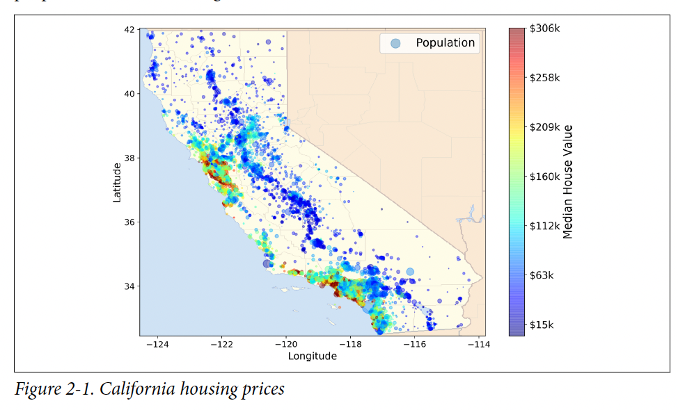
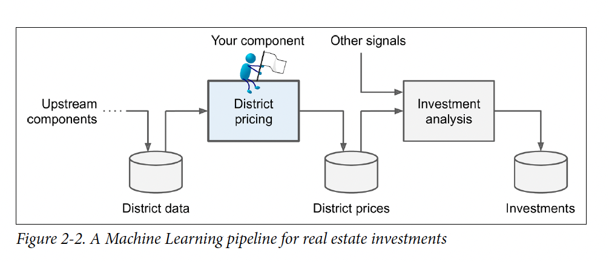
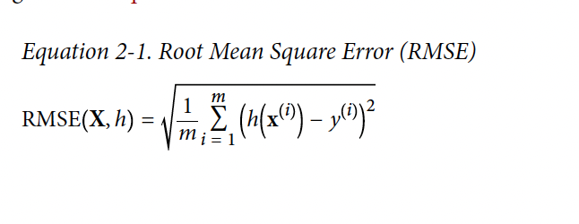
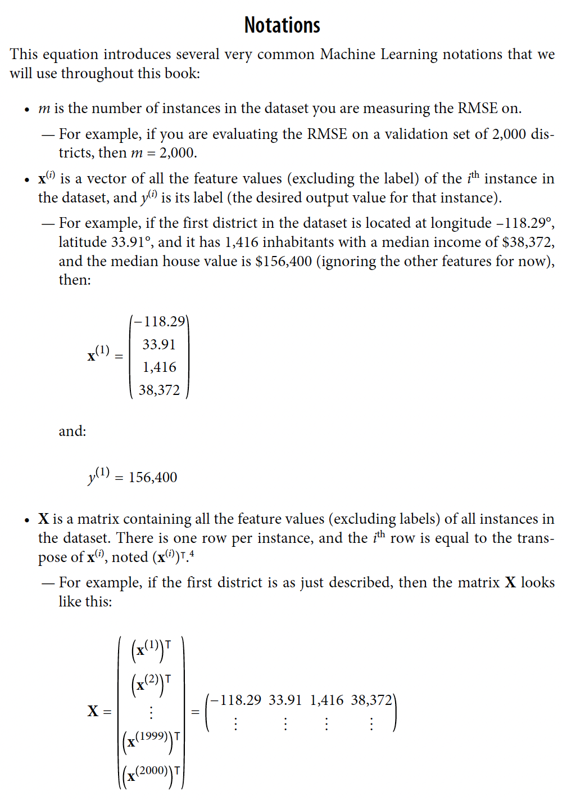
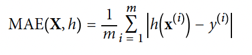

# End-to-End Machine Learning Project

In this chapter you will work through an example project end to end, pretending to be a recently hired data scientist at a real estate company.This example s fictious ;
the goal is to illustrate the main steps of a machine learning project, not to learn anything about real estate busines.Here are the main steps we will walk thourgh:

1. Look at the big picture
2. Get the data 
3. Explore and visualize the data gain insights
4. Prepare the data for machine learning algorithms 
5. Select a model and train it 
6. Fine-tune my model
7. Present my solution.
8. Launcg, monitor, and maintain my system.

## Working with Real Data

When you are learning about machinea learning, it is best to experiment with real-world data, not artificial datasets. Fortunately, there are thousands of open datasets to choose from, ranging across all sorts of domains. Here are few places you can look to get data.

* Popular open data repositories:
- - OpenML.org(https://penml.org)
- - Kaggle.com (htt^s://kaggle.com/datasets)

- - PaperWithCode.com(https://paperswitthcode.com/datasets)

....................... HML page 40

In this chapter we'll use the California Housing Prices dataset from the Statlib repository. This dataset is based on data from 1990 California census. It is not exactly recent(a nice house in the Bay area was still affordabe at the time), but it has many qualities for learning. so we will pretend it is recent data for teaching purposes. I've added a categorical attribute and removed a few features.

## Look at the Big Picture
Welcome to the Machine Learning Housing Corporation! You first task is to use California census data to build a model of housing prices in the state.This data includes metrics such as the population, median income, and median housing price for each block group in California. Block groups are the smallest geographical unit for which the US Census Bureau publishes sample data(a block group typically has a population of 600 to 3,000 people). I will call them "districts" for short.

Your model should learn from this data and be able to predict the median housing price in any district, given all the other metrics. 

## Clarification 

A metric is just a genral term it can be a attribute/feature or a label.A feature is the  actual value and the attribute is the name for example mileage , mileage is the attrbiute if its 3000 then 3000 is the feature.
Now in this example when we use metric some of the named metric may be attributes/features or just labels meaning the outputs.

## Continuation
 Since you are a well-organized data scientist, the first thing you should do is pull out your machinear learning project checklist. You can start with the one in Appendix A; it should work reasonably wel lfor most of the machine learning projects ,but make sure to addapt it to that specific project, we wil lskip a few because they are self-explanatory or because they will be discussed in later chapters.

 ## Frame the Problem
 The first question to ask your boss is what exactly the buisiness objective is . Knowing the objective is important it will determine how you frame the prbolem, which algorithm wil lbe slected , which performence measure you will use to evaluate your model and how much effort you wil lspend tweaking.

Boss's reponse: your model's output(a prediction of a district's median housing price) will be fed o another machine laerning system, along with many other signals. This downstream system will determine wether it is worth investing in a given area. Getting this right is critical as it directly affects revenue.

The next question to ask your boss is what the current solution looks like(if any). The current situation will often give you a reference to perfromance ,as wel las insights on how to solve the problem . 

Boss's response: district housing prices are currently estimated manually by experts: a team gathers up-to-date information about a district, and when they cannot get the median housing price, they estimate it using complex rules.
## Clarification 
But Josue, what makes this a machine learning problem ?
1. Complex set of rules in the boss's reponse he said that district hosuing prices are currently estimated manually by experts. 

2. No known algorithm right ? I mean this rule comes from the complex rules thing but if you have to invent complex set of rules proalby no known algorithms to do it .

3. Framing the project (T,E,P)

- Task (T): Predicting the median housing price for a given district

- The Experience(E): The California census data containing thousands of districts with their attributes (population, income, etc.) and their actual prices

-  The Performance Measure(P): The RMSE (Root Mean Square Error), which tells us exactly how many dollars off our predictions are from the real expert-verified prices

This(their current approach) is costly and time-consuming. That's why the ythink they need to train a model to predict a district's median housing price, given other data about that district. 

## Pipelines 
A sequence of data processing components is called data pipeline. Pipelijnes are very common in machine  since there are a lot to manipulate ad many data transformations to apply.

Components of a data pipeline often run assyncroously. Each components pulls in a alrge amount of data then it spits out the result in another data store. Then, some time later the next component pulls in this data . It's literally a pipeline feeding data gets an output and feet that output to some other component. Each component is self-contained(independent island, like if you have a Java class that does exactly one thing and does overflow with another class ). 
Note that in data pipelining a broken compoent may go unnoticed if proper monitoring is not implimented.

## Mapping the Machine Learning Approach

With all this information, you should be ready to start designing the system

1. What kind of trainning supervision? 
    

    * Supervised learning: Yes because our goal is to predict a price we have trainning instances
    * Unsupervised learning: No we have label data sets and we are not trying to find hidden patterns
    * Self-supervised: No we are not hidnig nany label or iamges and ask the model to rebuild or reconstruct it .
    * Semi-supervised: No we have afully label data sets so ...

2. What task is it ? Classifiaction task, regression task or somethign else ?
    * I think it is a regression task, well rpediction
    should ring a bell, to regression task
    * Classficatio cannot be an option because we are not classifying anything.

3. Is it batch or online learning 
    *  I think it is batch learning because, well you have a huge data sets the prices don't fluacte overnight just liek that .
    But note `if the data  were huge, you could either split your batch learning work across mltiple servers using (MapReduce technique) or use an online learning technique.`

    ## Select a Performance Measure.

    A typical me performance measure for regression problems is the root mean square error (RMSE)
    

    ### Analysis

    this is where the machien grades it self:
    1. the substraction is where it checks the distance between the truth and the prediction.

    2. the square, we square it to make sure that we geet postive answers  so lets say a predictio nis 10 unit of it could be 10 unit off negatively or postiely so thats why we square.

    3. sigma, take the sum of all predictions from 1 to m 
    5. take the average  now we can take the square root 
    to get non squared values imagine you were using mean squared theorem with heights well you don't want t obe working with m^2 you want meters (m).

    x^(i) it's a vector of all the features values, excluding the label of the ith isntance in the data set y^(i) is its label (the desired output for that specifc instance )

### Notations

Note that  other performeasure measure exist like the mean absolute error 

### Always check the assuptions
What if they asked to say if the price is High, Medium, Low. Well then you don't have to do a regression model but rather a classfication task. Regression is for continuous numeric value. Whereas classfication is for discrete category or class.

### Recall 

Instanced based learning the system learns by heart, when it see a new model it looks for the most similar example it already knows.

Model based learning the sytem uses data build a mathematical formula.In regression it find the best parameters m and b in y  mx+b in order to make prediction. So yeah linaer regression is model-based.

## Go to Chapter 2 – End-to-end Machine Learning project python charm