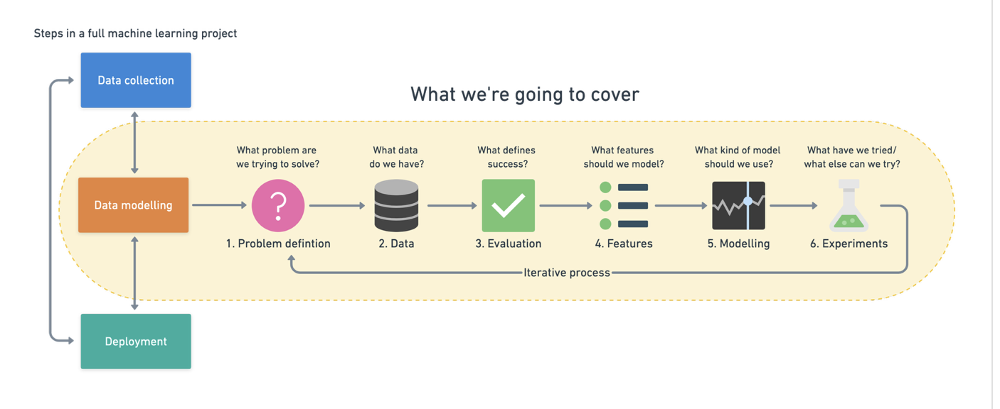

# What is Machine Learning ?
According to the creator of ZTM , the simpelst definiton of machine learning is the process of finding patterns in data to understand something more or to predict some kind of futre event.

What makes a machine learning algorithm different is instead of having a set of rules or instructions, you start with the ingredients and the final dish ready to go. The machine learning algorithm then looks at the ingredients and the final dish and works out the set of instructions or rules

# Can you ML-Learn It ?
A machine learning pipeline can be broken down into three major steps. 
1.  Data collection: for example , collecting customer purchases in a spreadsheet.

2.  Data modelling: refers to using a machine learning algorithm to     find insights within your collected data

3.  Data deployment: taking your set of instructions and using it in an aplication. This application could be anything fro mrecommending 
    products to customers on your online store to a hospital trying to better predict disease presence.

# How to break down a Machine Learning Problem ?

1.  Problem defintion - What business problem are we trying to solve? How can it be phrased as a machine learning problem?

2.  Data-If machine learning is getting insights out of data, what data we have ? How does it match the problem definition? Is our data structured or         
    unstructured.? Static or streaming?

3.  Evaluation-What defiens sucess? Is a 95% accurate machine learning good enough?

4.  Features-What parts of our data are we going to use for our model? How can what we already know influence this?

5.  Modelling-Which model shold you choose?How can you improve it? How do you compare it with other models?

6.  Experimentation-What else could we try? Does our deployed model do as we expected?How do the other steps change based on what we've found?

