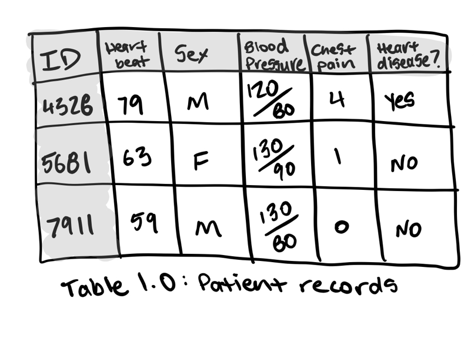
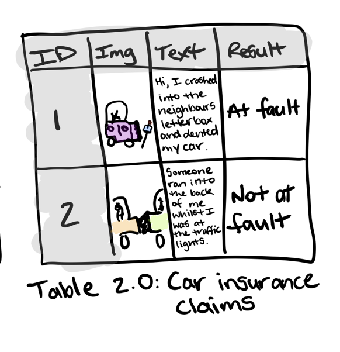

# What is Machine Learning ?
According to the creator of ZTM , the simpelst definiton of machine learning is the process of finding patterns in data to understand something more or to predict some kind of futre event.

What makes a machine learning algorithm different is instead of having a set of rules or instructions, you start with the ingredients and the final dish ready to go. The machine learning algorithm then looks at the ingredients and the final dish and works out the set of instructions or rules

# Can you ML-Learn It ?
A machine learning pipeline can be broken down into three major steps. 
1.  Data collection: for example , collecting customer purchases in a spreadsheet.

2.  Data modelling: refers to using a machine learning algorithm to     find insights within your collected data

3.  Data deployment: taking your set of instructions and using it in an aplication. This application could be anything fro mrecommending 
    products to customers on your online store to a hospital trying to better predict disease presence.

# How to break down a Machine Learning Problem ?

1.  Problem defintion - What business problem are we trying to solve? How can it be phrased as a machine learning problem?

2.  Data-If machine learning is getting insights out of data, what data we have ? How does it match the problem definition? Is our data structured or         
    unstructured.? Static or streaming?

3.  Evaluation-What defiens sucess? Is a 95% accurate machine learning good enough?

4.  Features-What parts of our data are we going to use for our model? How can what we already know influence this?

5.  Modelling-Which model shold you choose?How can you improve it? How do you compare it with other models?

6.  Experimentation-What else could we try? Does our deployed model do as we expected?How do the other steps change based on what we've found?

Diving deeper in each:

## 1. Problem definition 
To help decide wheter or not your business could use machine learning, the first step is to match the buisiness problem you are trying to solve a machine learning problem.

The four major types of machine learning are supervised learning, unsupervised learning, transfer learning and reinforcement learning(ofc there is semi-supervised learning)

I will focus on Transfer Learning since I  did not expand on that before:

Transfer learning is when you take the information of an existing machine learning model has learned and adjust it to your own problem.
Training a ml model from scratch can be expensive and time-consuming.
The good news is, you don't always have to. When a machine laerning algorithms find pattern in one kind of data, these patterns can be used in another type of data. For example, you're a car insurance company and wanted to build a text classification model to classify wether or not somoene submitting an insurance claim for a car accident is at fault(caused the accident) or not at fault (didn't cause the accident) . You could start with an existing text model, one which has read all of Wikipedia and has rembered all the patterns between different words such as which word is more likely to come next after another. Then using your car insurance claims(data) along with their outcomes (labels), you could tweak the existing text model to your own problem. If machine learning can be used in your business it's likely it will fall under these 3 types of learning(in this context learning mean what kind of output it is. or what kind of task the machine is doing)

* Regression: the task of predicting a continuous numeric value, liek the exact price of a house or a car.

* Classification: the task of  putting things into discrete categories like "spam" or "not spam". when they are more than two labels (multi-labels) we call it multi-class classification.

* Recommendation: A specialized task where the machine predicts what a user might like next based on similar things they or others bought.

Now that these things were explained, ca you define your buisiness problem in machine learning terms.

Can you ml-learn it ?
Let's look at the car insurrance company problem: `We're a car insurance company who want to classify incoming car insurance claims into at fault or not at fault`

Bells ringing : The first thing that should come to your mind is `This is a potential classic machine learning classfication problem. But they are chances that it might not be.`

## 2. Data-if machine learnign is getting insights out of data what data do you have ?

The data you have or need to collect will depend on the problem you want to solve. if you already have data, it's likely it will be in one of two forms structured or unstructured. Within each of these, you have stattic or streaming data

* Structured data- Think a table of rows and columns, an Excel spreadsheet of customer transactions, a database of patient recors. Columns can be numerical, such as average heart rate, categorical, such as sex, or ordinal, such as chest pain intensity.

* Unstructured data- Anything not immediatly able to put into row and column format, images, audio files, natiral language text.

* Static data -Exostong historical data whcih is unlikely to hange. you companies customer purchase history is a good example.

* Streaming data- Data which is constantly updated, older recors may be changed newer records are constantly being added .

For predicting heart disease it could look like this 

For the insurance claim example, one column may be the text a customer has sent in for the claim, another may be the image they've sent in along the text and a final column being the outcome of the claim. This table gets updated with the new claim or altered results of old claims daily.

## 3. Evaluation — What defines success? Is a 95% accurate machine learning model good enough?

(taken form ztm directly)
A 95% accurate model may sound pretty good for predicting who’s at fault in an insurance claim. But for predicting heart disease, you’ll likely want better results.

Other things you should take into consideration for classification problems.

* False negatives — Model predicts negative, actually positive. In some cases, like email spam prediction, false negatives aren’t too much to worry about. But if a self-driving cars computer vision system predicts no pedestrian when there was one, this is not good.

* False positives — Model predicts positive, actually negative. Predicting someone has heart disease when they don’t, might seem okay. Better to be safe right? Not if it negatively affects the person’s lifestyle or sets them on a treatment plan they don’t need.

* True negatives — Model predicts negative, actually negative. This is good.

* True positives — Model predicts positive, actually positive. This is good.

* Precision — What proportion of positive predictions were actually correct? A model that produces no false positives has a precision of 1.0.

* Recall — What proportion of actual positives were predicted correctly? A model that produces no false negatives has a recall of 1.0.

* F1 score — A combination of precision and recall. The closer to 1.0, the better.

* Receiver operating characteristic (ROC) curve & Area under the curve (AUC) — The ROC curve is a plot comparing true positive and false positive rate. The AUC metric is the area under the ROC curve. A model whose predictions are 100% wrong has an AUC of 0.0, one whose predictions are 100% right has an AUC of 1.0.

For regression problems (where you want to predict a number), you’ll want to minimise the difference between what your model predicts and what the actual value is. If you’re trying to predict the price a house will sell for, you’ll want your model to get as close as possible to the actual price. To do this, use MAE or RMSE.

* Mean absolute error (MAE) — The average difference between your model's predictions and the actual numbers.

* Root mean square error (RMSE) — The square root of the average of squared differences between your model's predictions and the actual numbers.

## 4. Features — What features does your data have and which can you use to build your model?

* Categorical features — One or the other(s). For example, in our heart disease problem, the sex of the patient. Or for an online store, whether or not someone has made a purchase or not.

* Continuous (or numerical) features — A numerical value such as average heart rate or the number of times logged in. Derived features — Features you create from the data. Often referred to as feature engineering. Feature engineering is how a subject matter expert takes their knowledge and encodes it into the data. You might combine the number of times logged in with timestamps to make a feature called time since last login. Or turn dates from numbers into “is a weekday (yes)” and “is a weekday (no)”.

Text, images and almost anything you can imagine can also be a feature. Regardless, they all get turned into numbers before a machine learning algorithm can model them.

Some important things to remember when it comes to features.

* Keep them the same during experimentation (training) and production (testing) — A machine learning model should be trained on features which represent as close as possible to what it will be used for in a real system.

* Work with subject matter experts — What do you already know about the problem, how can that influence what features you use? Let your machine learning engineers and data scientists know this.

* Are they worth it? — If only 10% of your samples have a feature, is it worth incorporating it in a model? Have a preference for features with the most coverage. The ones where lots of samples have data for.

* Perfect equals broken — If your model is achieving perfect performance, you’ve likely got feature leakage somewhere. Which means the data your model has trained on is being used to test it. No model is perfect.

## 5. Modelling — Which model should you choose? How can you improve it? How do you compare it with other models?

When choosing a model, you’ll want to take into consideration, interpretability and ease to debug, amount of data, training and prediction limitations.

* Interpretability and ease to debug — Why did a model make a decision it made? How can the errors be fixed?

* Amount of data — How much data do you have? Will this change?

* Training and prediction limitations — This ties in with the above, how much time and resources do you have for training and prediction?

Tuning and improving a model

A model's first results isn’t its last. Like tuning a car, machine learning models can be tuned to improve performance.

Tuning a model involves changing hyperparameters such as learning rate or optimizer. Or model-specific architecture factors such as number of trees for random forests and number of and type of layers for neural networks.

These used to be something a practitioner would have to tune by hand but are increasingly becoming automated. And should be wherever possible.

Using a pre-trained model through transfer learning often has the added benefit of all of these steps been done.

The priority for tuning and improving models should be reproducibility and efficiency. Someone should be able to reproduce the steps you’ve taken to improve performance. And because your main bottleneck will be model training time, not new ideas to improve, your efforts should be dedicated towards efficiency.

Comparing models

Compare apples to apples.

Model 1, trained on data X, evaluated on data Y.
Model 2, trained on data X, evaluated on data Y.
Where model 1 and 2 can vary but not data X or data Y

## 6. Experimentation — What else could we try? How do the other steps change based on what we’ve found? Does our deployed model do as we expected?

This step involves all the other steps. Because machine learning is a highly iterative process, you’ll want to make sure your experiments are actionable.

Your biggest goal should be minimising the time between offline experiments and online experiments.

Offline experiments are steps you take when your project isn’t customer-facing yet. Online experiments happen when your machine learning model is in production.

All experiments should be conducted on different portions of your data.

* Training data set — Use this set for model training, 70–80% of your data is the standard.

* Validation/development data set — Use this set for model tuning, 10–15% of your data is the standard.

* Test data set — Use this set for model testing and comparison, 10–15% of your data is the standard.
These amounts can fluctuate slightly, depending on your problem and the data you have.

Poor performance on training data means the model hasn’t learned properly. Try a different model, improve the existing one, collect more data, collect better data.

Poor performance on test data means your model doesn’t generalise well. Your model may be overfitting the training data. Use a simpler model or collect more data.

Poor performance once deployed (in the real world) means there’s a difference in what you trained and tested your model on and what is actually happening. Revisit step 1 & 2. Ensure your data matches up with the problem you’re trying to solve.